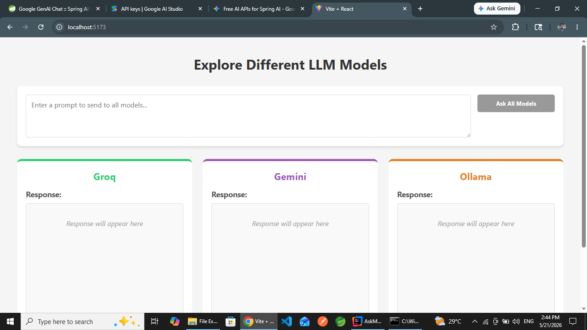
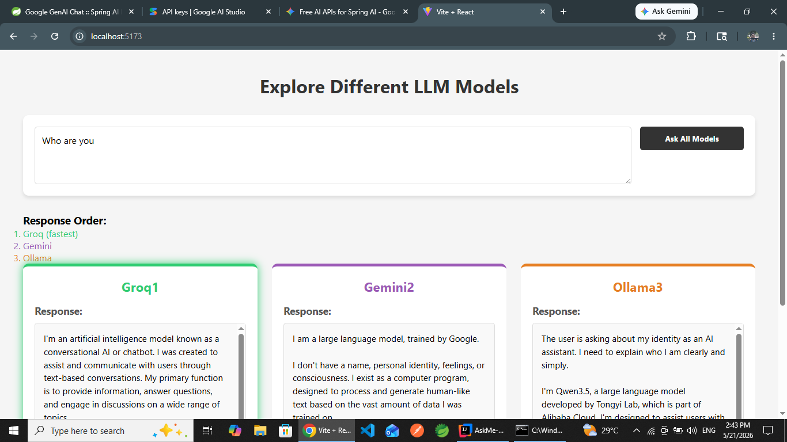
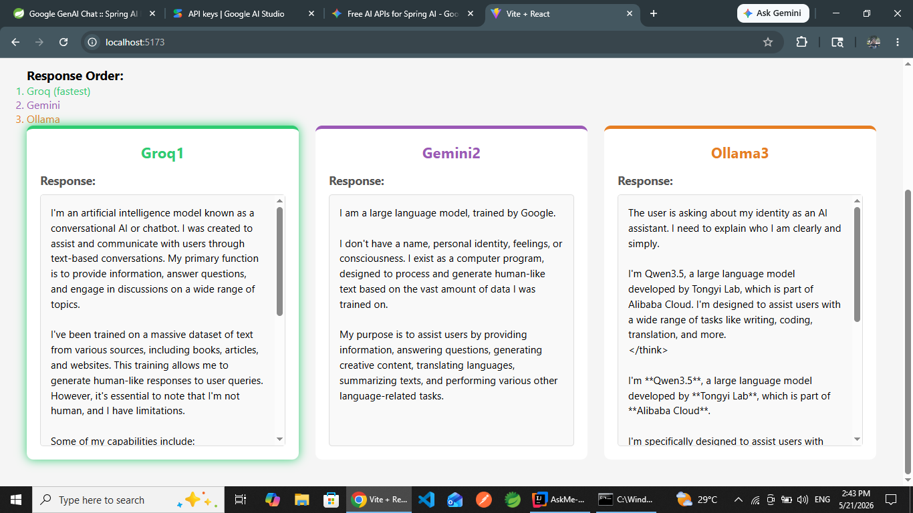

# 🤖 AskMe : SpringAI-Powered Question Answerin Application

A full-stack application that leverages multiple AI models (Groq, Ollama, and GenAI) to provide intelligent question-answering capabilities with a modern React frontend and Spring Boot backend.

## 📋 Table of Contents

- [Features](#features)
- [Project Structure](#project-structure)
- [Screenshots](#screenshots)
- [Tech Stack](#tech-stack)
- [Prerequisites](#prerequisites)
- [Installation](#installation)
- [Configuration](#configuration)
- [API Documentation](#api-documentation)
- [Running the Application](#running-the-application)
- [Development](#development)
- [Contributing](#contributing)
- [License](#license)

## ✨ Features

- 🧠 **Multi-AI Integration**: Support for multiple AI providers (Groq, Ollama, GenAI)
- ⚡ **Real-time Responses**: Fast, responsive question-answering interface
- 🎨 **Modern UI**: Built with React and Vite for optimal performance
- 🔧 **RESTful API**: Clean, well-documented API endpoints
- 📱 **Responsive Design**: Works seamlessly across devices
- 🚀 **Production Ready**: Optimized backend with Spring Boot

## 🏗️ Project Structure

```
AskMeApp/
├── AskMe-Backend/                 # Spring Boot Application
│   ├── src/
│   │   ├── main/
│   │   │   ├── java/
│   │   │   │   └── com/tilak/AskMe/
│   │   │   │       ├── AskMeApplication.java
│   │   │   │       ├── GenAi/
│   │   │   │       │   └── GenAiController.java
│   │   │   │       ├── Groq/
│   │   │   │       │   └── GroqController.java
│   │   │   │       └── Ollama/
│   │   │   │           └── OllamaController.java
│   │   │   └── resources/
│   │   │       └── application.properties
│   │   └── test/
│   │       └── java/AskMeApplicationTests.java
│   └── pom.xml
├── AskMe-frontend/                # React + Vite Application
│   ├── src/
│   │   ├── components/
│   │   ├── App.jsx
│   │   ├── main.jsx
│   │   ├── assets/
│   │   └── styles/
│   ├── package.json
│   ├── vite.config.js
│   └── eslint.config.js
├── ScreenShots/                   # Application Screenshots
└── README.md
```

## 📸 Screenshots

### Dashboard Interface

*First Look: The intuitive dashboard of AskMe application*

### Question Interface

*Interactive Question Interface: Ask your questions with multiple AI model options*

### Response Display

*Detailed Response Display: View comprehensive answers from selected AI models*

## 🛠️ Tech Stack

### Backend
- **Framework**: Spring Boot
- **Language**: Java 21
- **Build Tool**: Maven
- **API Integrations**:
  - Groq API
  - Ollama Local Model 
  - Google GenAI

### Frontend
- **Framework**: React 18+
- **Build Tool**: Vite
- **Styling**: CSS
- **Package Manager**: npm

## 📦 Prerequisites

Before you begin, ensure you have the following installed:

- **Java Development Kit (JDK)**: Version 11 or higher
  ```bash
  java -version
  ```
- **Apache Maven**: Version 3.6+
  ```bash
  mvn -version
  ```
- **Node.js**: Version 16 or higher
  ```bash
  node --version
  npm --version
  ```

## 🚀 Installation

### Backend Setup

1. Navigate to the backend directory:
   ```bash
   cd AskMe-Backend
   ```

2. Build the project:
   ```bash
   mvn clean install
   ```

3. Run the application:
   ```bash
   mvn spring-boot:run
   ```

   The backend will start on `http://localhost:8080`

### Frontend Setup

1. Navigate to the frontend directory:
   ```bash
   cd AskMe-frontend
   ```

2. Install dependencies:
   ```bash
   npm install
   ```

3. Start the development server:
   ```bash
   npm run dev
   ```

   The frontend will be available at `http://localhost:5173`

## ⚙️ Configuration

### Backend Configuration

Edit `AskMe-Backend/src/main/resources/application.properties`:

```properties
# Server Configuration
server.port=8080
server.servlet.context-path=/api

# Groq API Configuration
groq.api.key=your_groq_api_key
groq.api.url=https://api.groq.com/openai/v1

# Ollama Configuration
ollama.api.url=http://localhost:11434

# GenAI Configuration
genai.api.key=your_genai_api_key
genai.api.url=https://generativelanguage.googleapis.com/v1beta
```

### Frontend Configuration

The frontend automatically connects to `http://localhost:8080/api` during development. Update the API URL in your environment configuration if needed.

## 📡 API Documentation

### GenAI Controller

**Endpoint**: `POST /api/genai/ask`

**Request Body**:
```json
{
  "question": "What is machine learning?"
}
```

**Response**:
```json
{
  "answer": "Machine learning is a subset of artificial intelligence...",
  "timestamp": "2026-05-21T10:30:00Z"
}
```

### Groq Controller

**Endpoint**: `POST /api/groq/ask`

**Request Body**:
```json
{
  "question": "Explain quantum computing"
}
```

### Ollama Controller

**Endpoint**: `POST /api/ollama/ask`

**Request Body**:
```json
{
  "question": "What are neural networks?"
}
```

## 🎯 Running the Application

### Development Mode

**Terminal 1 - Backend**:
```bash
cd AskMe-Backend
mvn spring-boot:run
```

**Terminal 2 - Frontend**:
```bash
cd AskMe-frontend
npm run dev
```

### Production Build

**Backend**:
```bash
cd AskMe-Backend
mvn clean package
java -jar target/AskMe-*.jar
```

**Frontend**:
```bash
cd AskMe-frontend
npm run build
# Serve the dist folder with your preferred web server
```

## 💻 Development

### Backend Development

- Java source files: `AskMe-Backend/src/main/java/com/tilak/AskMe/`
- Running tests:
  ```bash
  mvn test
  ```

### Frontend Development

- React components: `AskMe-frontend/src/`
- ESLint configuration: `AskMe-frontend/eslint.config.js`
- Run linter:
  ```bash
  npm run lint
  ```

## 🤝 Contributing

Contributions are welcome! Please follow these steps:

1. Fork the repository
2. Create a feature branch (`git checkout -b feature/AmazingFeature`)
3. Commit your changes (`git commit -m 'Add some AmazingFeature'`)
4. Push to the branch (`git push origin feature/AmazingFeature`)
5. Open a Pull Request

### Code Standards

- Follow Java conventions for backend code
- Use ESLint for frontend code consistency
- Add comments for complex logic
- Write meaningful commit messages

## 📝 License

This project is licensed under the MIT License - see the LICENSE file for details.

## 📞 Support

For questions or issues, please open an issue on the GitHub repository.

---

**Built with ❤️ by Tilak | AskMe - Ask Anything, Get Answers Instantly**
